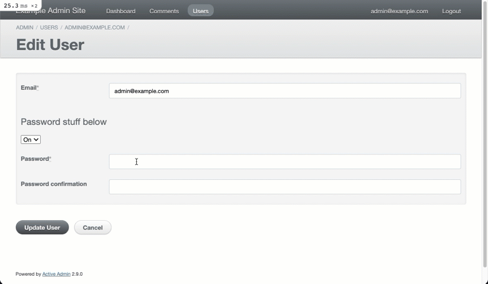

# README

This is an example Rails 6.x site that has ActiveAdmin, Devise and Stimulus.js, where Stimulus.js controllers are loaded into the admin, as well as the frontend.

## Setup
- Make sure you have Ruby 2.6.3 installed
- Make sure you have Postgres up and running (easiest way on macOS is the [Postgres.app](https://postgresapp.com/))
- Clone the repo `git clone git@github.com:cfurrow/ExampleActiveAdminWithStimulus.git`
- `cd ExampleActiveAdminWithStimulus`
- `bundle install`
- `bin/rails db:setup`
- `bin/webpack-dev-server` (this will continue to monitor changes to JS files, and build new webpack packs)
- (open a new terminal, and run) `bin/rails server`

## Testing ActiveAdmin + Stimulus
- visit http://localhost:3000/admin
- login with credentials found in `db/seeds.rb`
- Edit the user you see in the list

